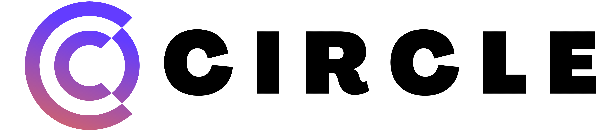

## DTC Team07 Project Circle


> Short Project Blurb
---


* [Description](#general-info)
* [How to use](#how-to-use)
* [Technologies](#technologies)
* [Contents](#content)
* [Author Info](#author-info)
---


## Description

---

## How-to-use

---
## Technologies
Technologies used for this project:
* HTML, CSS
* React
* Firebase
---
	
## Content
Content of the project folder:

```
 Top level of project folder: 
├── .gitignore               # Git ignore file
├── index.html               # landing HTML file, this is what users see when you come to url
└── README.md

It has the following subfolders and files:
├── .git                     # Folder for git repo
├── images                   # Folder for images
    /blah.jpg                # 
├── scripts                  # Folder for scripts
    /blah.js                 # 
├── styles                   # Folder for styles
    /blah.css                # 

Firebase hosting files: 
├── .firebaserc...


```
---
## Author-info
* Designer: Jason Lui
* Coder: Edward Lee
* Product Manager: Hairun Huang

---
**Version 1.0.0**
[Back to the top](#general-info)

